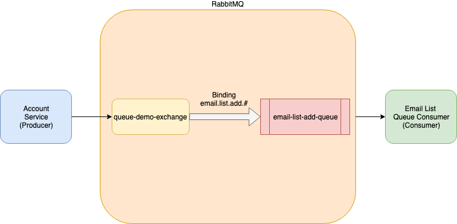
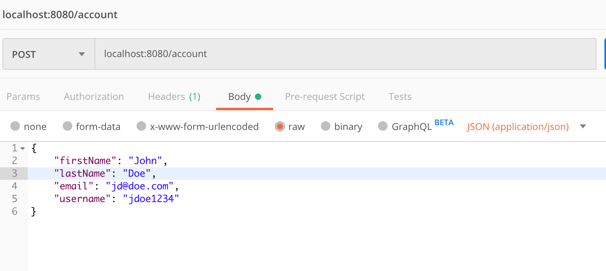
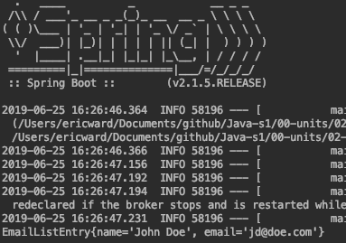
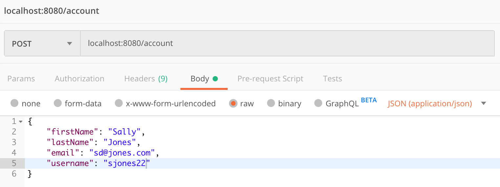
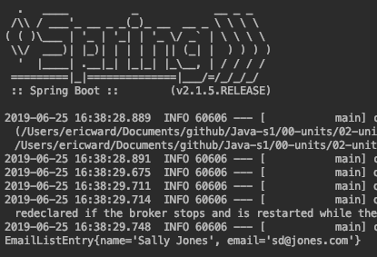
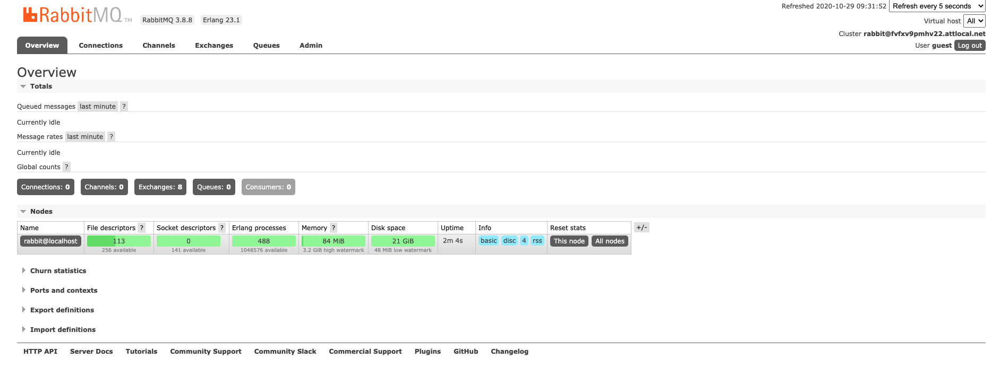
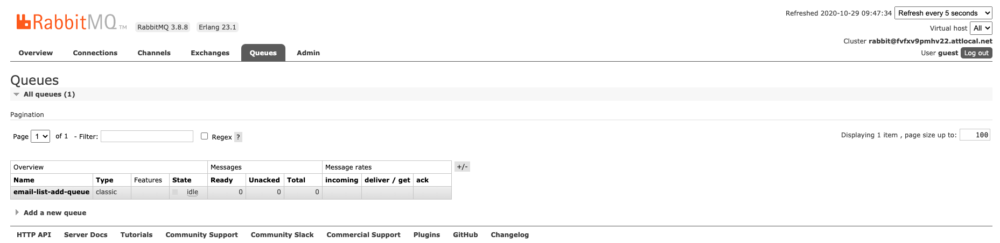
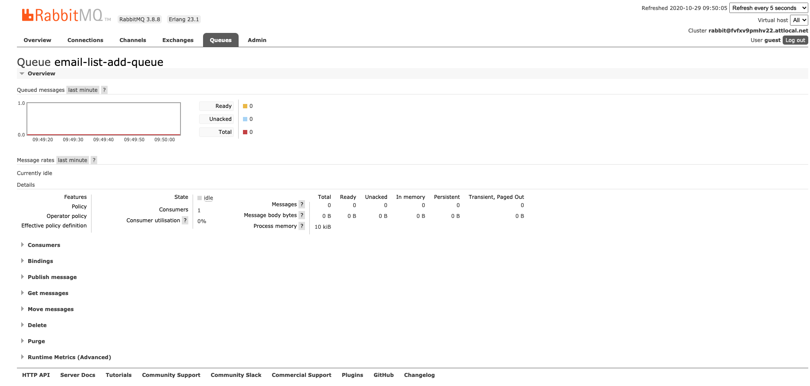
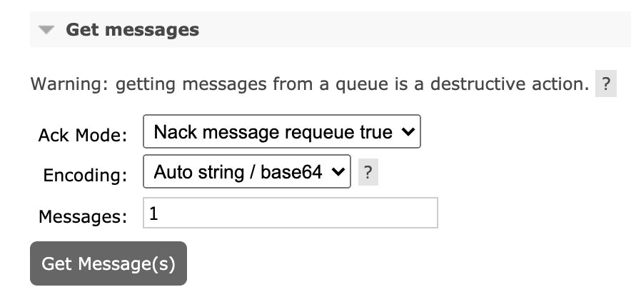
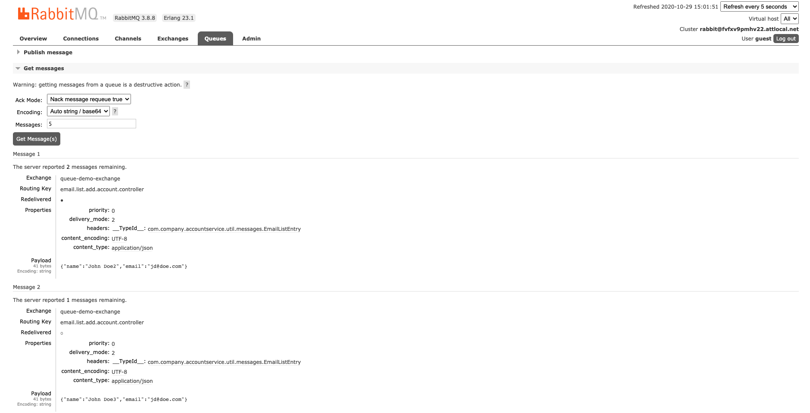

# Spring RabbitMQ Tutorial

This tutorial steps through the creation of a simple producer/consumer system that uses Spring Boot and RabbitMQ.

You will need:

* RabbitMQ (installed as part of this tutorial)
* Spring Initializr (start.spring.io)
* IntelliJ IDEA Community Edition

## System Design

The application you'll build in this tutorial simulates an account creation web service. 

The account creation is divided in two parts:

1. Create the main account.
2. Add a new account to the company email list.

It's critical that the main account gets created in a timely manner. Even though it's important that we add new members to the email list, we don't want the main account creation to be slowed down or otherwise adversely affected by issues with the email list system. 

We'll use a queue to process new email list entries. This allows the new account service to simply place the new email list entry request in the queue and move on. The queue entries will be processed asynchronously according to the availability and capacity of the email list creation service.

### Terminology

It's helpful to review queue-related terminology before we look at the design and begin implementation.

#### AMQP

Advanced Message Queuing Protocol (**AMQP**) is a messaging protocol that allows clients and messaging middleware to communicate in a standardized manner. RabbitMQ and the Spring client libraries conform to AMQP.

#### Producer

The **producer** is the application, process, or code that creates new entries and places them in the queue for processing.

#### Consumer

The **consumer** is the application, process, or code that processes, or consumes, the queue entries created by the producer.

#### Queue

A **queue** is a repository for messages. Producers place the messages in the queue. Consumers process the messages.

#### Exchange

An **exchange** is where producers send messages in an AMQP system. An exchange then routes the messages to one or more queues based on the type of exchange and routing rules (called bindings, explained below).

We will be using a **topic exchange** in this tutorial. Topic exchanges route messages to one or more queues based on a routing key and the pattern used to bind the exchange to the queue or queues. Topic exchanges allow consumers to choose which types of messages they want to process and which ones they want to ignore.

#### Binding

A **binding** is a rule that an exchange uses to route messages to a queue. Routing keys and binding rules can be used to filter messages and only send certain messages to certain queues.

### Email List System

The following diagram shows our email list system:



The **account service** is a REST web service that processes incoming new account requests. Part of that processing includes sending a new email list entry message to the ```queue-demo-exchange```. Messages sent to the exchange are routed to the ```email-list-add-queue``` and then processed by the **email list queue consumer** application. 

## Building the System

We will build the system in the following steps:

1. Install RabbitMQ.
2. Create the consumer application.
3. Create the producer application.
4. Process objects.

### Step 1: Install RabbitMQ

The first step is to install the latest version of RabbitMQ for your platform from here: https://www.rabbitmq.com/download.html.

**Window users:**
1. The simplest RabbitMQ installation requires the use of [Chocolatey](https://community.chocolatey.org/). Install Chocolatey as described [here](https://chocolatey.org/install). You should perform the *Individual* installation, using an *administratrive shell*.
1. After you've installed Chocolatey, use it to install RabbitMQ as described [here](https://www.rabbitmq.com/install-windows.html#chocolatey).

**Mac users:** Use Homebrew. First install Homebrew by following the directions at https://brew.sh/ and then install RabbitMQ.

### Step 2: Create the Consumer Application

The next step is to create the application that will process the messages from the queue.  We'll use the Spring Initializr to create our project. Go to ```start.spring.io``` and enter the follow information:

- Group = com.trilogyed
- Artifact = email-list-queue-consumer
- Dependencies = Spring for RabbitMQ

Download the project, copy it into your working directory, and open the project in IntelliJ.

It is worth noting that this application is **not** a web service; it is just a queue consumer.

#### 2.1: Create the Message Class

Now we will create a Java class that will act as the message in our system. This class will be present both in the consumer application and in the producer application. 

Create a new class called ```com.trilogyed.emaillistqueueconsumer.util.messages.EmailListEntry```. Add the following code to your new class:

```java
public class EmailListEntry {

    private String name;
    private String email;

    public EmailListEntry() {

    }

    public EmailListEntry(String name, String email) {
        this.name = name;
        this.email = email;
    }

    public String getName() {
        return name;
    }

    public void setName(String name) {
        this.name = name;
    }

    public String getEmail() {
        return email;
    }

    public void setEmail(String email) {
        this.email = email;
    }

    @Override
    public String toString() {
        return "EmailListEntry{" +
                "name='" + name + '\'' +
                ", email='" + email + '\'' +
                '}';
    }
}
```

Items to note about this code:

1. The no-argument constructor -  Jackson requires a no-argument constructor to marshal and unmarshal the messages. The other constructor is a convenience.
2. Each property has a getter and setter. Again, Jackson requires getters and setters to marshall and unmarshall the messages.
3. The ```toString()``` method is the implementation that IntelliJ generates.

#### 2.2: Add the Jackson Converter Libraries

Next, we will add the Jackson converter libraries. These are the same libraries used to convert Java objects to JSON and vice versa in Spring Boot REST web services. These libraries will allow the system to convert messages to Java objects and vice versa. 

Open the project ```pom.xml``` file and add the following dependencies:

```xml
		<dependency>
			<groupId>com.fasterxml.jackson.core</groupId>
			<artifactId>jackson-core</artifactId>
			<version>2.9.8</version>
		</dependency>
		<dependency>
			<groupId>com.fasterxml.jackson.core</groupId>
			<artifactId>jackson-annotations</artifactId>
			<version>2.9.8</version>
		</dependency>
		<dependency>
			<groupId>com.fasterxml.jackson.core</groupId>
			<artifactId>jackson-databind</artifactId>
			<version>2.9.8</version>
		</dependency>
```

#### 2.3: Configure the Exchange, Queue, Binding, and Converter

The next step is to configure our exchange and bind it to our queue, as follows:

1. Create the topic exchange and queue names.
1. Create a queue.
1. Create a ```TopicExchange```.
1. Create a binding.
1. Create a ```jackson2JsonMessageConverter```.

We'll do all of this in our main ```@SpringBootApplication``` class. Open ```com.trilogyed.emaillistqueueconsumer.EmailListQueueConsumerApplication``` (which was automatically created by the Spring Initializr), and add code so that it looks like this:

```java
package com.trilogyed.emaillistqueueconsumer;

import org.springframework.amqp.core.Binding;
import org.springframework.amqp.core.BindingBuilder;
import org.springframework.amqp.core.Queue;
import org.springframework.amqp.core.TopicExchange;
import org.springframework.amqp.support.converter.Jackson2JsonMessageConverter;
import org.springframework.boot.SpringApplication;
import org.springframework.boot.autoconfigure.SpringBootApplication;
import org.springframework.context.annotation.Bean;

@SpringBootApplication
public class EmailListQueueConsumerApplication {

	public static final String TOPIC_EXCHANGE_NAME = "queue-demo-exchange";
	public static final String QUEUE_NAME = "email-list-add-queue";
	public static final String ROUTING_KEY = "email.list.add.#";

	@Bean
	Queue queue() {
		return new Queue(QUEUE_NAME, false);
	}

	@Bean
	TopicExchange exchange() {
		return new TopicExchange(TOPIC_EXCHANGE_NAME);
	}

	@Bean
	Binding binding(Queue queue, TopicExchange exchange) {
		return BindingBuilder.bind(queue).to(exchange).with(ROUTING_KEY);
	}

	@Bean
	public Jackson2JsonMessageConverter jackson2JsonMessageConverter() {
		return new Jackson2JsonMessageConverter();
	}

	public static void main(String[] args) {
		SpringApplication.run(EmailListQueueConsumerApplication.class, args);
	}
}
```

Items to note about this code:

1. The `@Bean` annotation means that ```Queue```, ```TopicExchange```, ```Binding```, and ```Jackson2JsonMessageConverter``` are all set up as Spring-managed beans. 
1. The second parameter of the ```Queue``` constructor indicates whether the queue should be durable between restarts of the RabbitMQ broker. This means that messages in the queue will not be destroyed when RabbitMQ is restarted. We do not need the queue to be durable for this demo.  TODO: CHECK IF THIS IS TRUE
1. Our binding specifies that any message sent to our topic exchange with the routing key of ```email.list.add.#``` (where # is one or more characters) will be routed to our queue. We'll configure our producer to use this routing key.


#### 2.4: Create the Message Listener

Now we will create the message listener. This component listens for messages on the queue and processes them. Our component will simply print the message content to standard out. A real application would take the information and send it to an application responsible for creating a new entry in the Email List database.

Create a new class called ```com.trilogyed.emaillistqueueconsumer.MessageListener```. Add the following code to your new class:

```java
@Service
public class MessageListener {

    @RabbitListener(queues = EmailListQueueConsumerApplication.QUEUE_NAME)
    public void receiveMessage(EmailListEntry msg) {
        System.out.println(msg.toString());
    }
}
```

Items to note about this code:

1. We use the the ```@Service``` annotation to let Spring Boot know that it should create an instance of this component when the application starts.
1. We use the ```@RabbitListener``` to specify what method to run when a message is detected. In this case, we run the method ```receiveMessage```. We also specify the queues this component will listen to.
1. The ```receiveMessage``` method processes our messages. It takes an ```EmailListEntry``` message as a parameter and processes it. In our case, it just prints the message; an actual application would use the message contents to create a new email list entry.

### Step 3: Create the Producer Application

Now we will create the application that will produce messages and send them to our topic exchange.  We'll use the Spring Initializr to create our project. Go to ```start.spring.io``` and enter the following information:

- Group = com.trilogyed
- Artifact = account-service
- Dependencies = Spring Web, Spring for RabbitMQ

Download the project, copy it into your working directory, and open the project in IntelliJ.

#### 3.1: Create the Message Class

Now we will create a Java class that will act as the message in our system. This class is identical to the message class we created in the consumer application above.

*Note:* In a production setting, this class would likely be contained in a shared library so that we could avoid this duplication of code. 

Create a new class called ```com.trilogyed.accountservice.util.messages.EmailListEntry```. Add the following code to your new class:

```java
public class EmailListEntry {

    private String name;
    private String email;

    public EmailListEntry() {

    }

    public EmailListEntry(String name, String email) {
        this.name = name;
        this.email = email;
    }

    public String getName() {
        return name;
    }

    public void setName(String name) {
        this.name = name;
    }

    public String getEmail() {
        return email;
    }

    public void setEmail(String email) {
        this.email = email;
    }

    @Override
    public String toString() {
        return "EmailListEntry{" +
                "name='" + name + '\'' +
                ", email='" + email + '\'' +
                '}';
    }
}
```

See the notes about this class found in Section 2.1 above.

#### 3.2: Create the Account Class

Next, we will create the ```Account``` class. The ```Account``` class contains all of the information required to create an account for this system, including the information needed for a new email list entry. 

Create a new class called ```com.trilogyed.accountservice.model.Account```, and add the following code:

```java
public class Account {

    private String firstName;
    private String lastName;
    private String email;
    private String username;

    public String getFirstName() {
        return firstName;
    }

    public void setFirstName(String firstName) {
        this.firstName = firstName;
    }

    public String getLastName() {
        return lastName;
    }

    public void setLastName(String lastName) {
        this.lastName = lastName;
    }

    public String getEmail() {
        return email;
    }

    public void setEmail(String email) {
        this.email = email;
    }

    public String getUsername() {
        return username;
    }

    public void setUsername(String username) {
        this.username = username;
    }
}
```


#### 3.3: Configure the ```RabbitTemplate``` and Message Converter

Like the consumer application, this application requires the Jackson library to convert messages to Java objects and vice versa. Our application also requires a ```RabbitTemplate``` to send messages to the topic exchange. We will set both of these up in the main application class. 

Open the main ```com.trilogyed.accountservice.AccountServiceApplication``` class (which was automatically created by the Spring Initializr), and add code so it looks like this:

```java
package com.trilogyed.accountservice;

import org.springframework.amqp.rabbit.connection.ConnectionFactory;
import org.springframework.amqp.rabbit.core.RabbitTemplate;
import org.springframework.amqp.support.converter.Jackson2JsonMessageConverter;
import org.springframework.boot.SpringApplication;
import org.springframework.boot.autoconfigure.SpringBootApplication;
import org.springframework.context.annotation.Bean;

@SpringBootApplication
public class AccountServiceApplication {

	@Bean
	public RabbitTemplate rabbitTemplate(ConnectionFactory connectionFactory) {
		RabbitTemplate rabbitTemplate = new RabbitTemplate(connectionFactory);
		rabbitTemplate.setMessageConverter(jackson2JsonMessageConverter());
		return rabbitTemplate;
	}

	@Bean
	public Jackson2JsonMessageConverter jackson2JsonMessageConverter() {
		return new Jackson2JsonMessageConverter();
	}

	public static void main(String[] args) {
		SpringApplication.run(AccountServiceApplication.class, args);
	}
}
```

Items to note about this code:

1. The ```RabbitTemplate``` and ```Jackson2JsonMessageConverter``` are both Spring-managed beans.
2. We set both the ```ConnectionFactory``` (supplied by Spring) and the ```MessageConverter``` (our bean) to the ```RabbitTemplate```.

#### 3.4: Create the AccountController

Finally, we create the ```AccountController``` and the endpoint that creates the accounts. 

Create a new class called ```com.trilogyed.accountservice.controller.AccountServiceController```, and add the following code:

```java
@RestController
public class AccountServiceController {

    public static final String EXCHANGE = "queue-demo-exchange";
    public static final String ROUTING_KEY = "email.list.add.account.controller";

    @Autowired
    private RabbitTemplate rabbitTemplate;

    public AccountServiceController(RabbitTemplate rabbitTemplate) {
        this.rabbitTemplate = rabbitTemplate;
    }

    @RequestMapping(value = "/account", method = RequestMethod.POST)
    public String createAccount(@RequestBody Account account) {
        // create message to send to email list creation queue
        EmailListEntry msg = new EmailListEntry(account.getFirstName() + " " + account.getLastName(), account.getEmail());
        System.out.println("Sending message...");
        rabbitTemplate.convertAndSend(EXCHANGE, ROUTING_KEY, msg);
        System.out.println("Message Sent");

        // Now do account creation stuff...

        return "Account Created";
    }
}
```

Items to note about this code:

1. Imports were omitted for brevity.
1. This is a normal ```@RestController```.
1. We use the topic exchange name that we created when we built the consumer application and configured the topic exchange and binding.
1. We use a routing key that will route our message to the desired queue. Recall that we set the routing key in our binding to ```email.list.add.#```. The value of ```email.list.add.account.controller``` will route to our queue.
1. We're @Autowiring the ```RabbitTemplate``` bean that we created in the previous step.
1. Our endpoint does the following:
   * Creates an ```EmailListEntry``` from the incoming ```Account``` object.
   * Sends the ```EmailListEntry``` message to the topic exchange.
   * Prints out a message to the console. A production application would actually call other components to do the work necessary for creating the account.

## Run the System

Now that we've built the system, we want to demonstrate two scenarios when we run it:

* Normal message flow
* Messages getting queued up and then processed later when the consumer application goes offline for some period of time.

#### Step 1: Start RabbitMQ

##### Mac
Use the command ```brew services start rabbitmq```. 

##### Windows
RabbitMQ starts automatically on Windows.

#### Step 2: Start the Consumer Application

Run the consumer application in IntelliJ.

#### Step 3: Start the Producer Application

Run the producer application in IntelliJ.

#### Step 4: Send POST to the Producer Application

Send a POST to the producer application. It should look similar to this in Postman:



Notice the console output from the consumer application. It should look something like this:




#### Step 5: Stop the Consumer Application

Stop the consumer application. Now there is nothing listening to our queue.

#### Step 6: Send POST to the Producer Application

Send a POST to the producer application. It should look similar to this in Postman:



The service should return a message of "Account Created" even though the consumer application is down.

#### Step 7: Start the Consumer Application

Finally, start the consumer application. You should see output in the console similar to this right after the service starts up:




**Note:** This message was in the queue waiting to be processed when the consumer application restarted.

---

## Monitor Queues with the RabbitMQ Management User Interface

RabbitMQ offers an Admin Management User Interface that allows for a user interface dashboard style monitoring tool.
Once the RabbitMQ server has been started the Admin UI can be utilized by performing the following steps:
1. Open a browser and navigate to localhost:15672. If you don't see a login page, check the Troubleshooting section at the end of this document.
1. Enter the following credentials:
    * UserName: guest
    * Password: guest
1. After logging in you will see the RabbitMQ dashboard page:
    * From the Overview tab, click the Queues tab found in the middle of the page.

   

1. To view messages in a queue:
    * Click the queue that you would like to view (In this example the queue is email-list-add-queue)
    
    

    * On the lower-left menu click "Get Messages" to view the messages in the queue
    
    

    * Important Note: Take note of the value in the text box labeled Messages. This value defaults to 1. 
    This is the value that determines how many messages will be displayed. Raise this value if viewing 
    multiple messages is desired.

    

    * And finally, click the Get Message Button to view a list of messages.

    

1. It is recommended to return to the Run The System section above and rerun the Postman transactions while monitoring
the RabbitMQ Management User Interface to see messages flowing in and out of the queue.

--- 

## Troubleshooting

### How do I stop and start RabbitMQ?

#### Windows
RabbitMQ should be running as a service after installation via Chocolatey. In PowerShell, you can check that it is running with the command `Get-Service RabbitMQ`

To stop the service in PowerShell, you need to be running PowerShell as an administrator. Then, type `net stop rabbitmq`

To start the service in PowerShell, you need to be running PowerShell as an administrator. Then, type `net start rabbitmq`

#### Mac
To start, use the command ```brew services start rabbitmq```

To stop, use the command ```brew services stop rabbitmq```

Or if you did not install RabbitMQ with Homebrew, start it by typing ```rabbitmq-server``` on the commandline. To stop it, kill the process with Cmd-C.

### I don't see the login page for the management console (Windows).
If you don't see a login page, you need to take the extra step to enable the management console, as decribed [here](https://stackoverflow.com/questions/23500014/rabbitmq-started-but-cant-access-management-interface). The most common issue is solved as follows:
1. Open PowerShell as an Administrator
1. Change to the rabbitmq sbin directory. It will very likely be something like `C:\Program Files\RabbitMQ Server\rabbitmq_server-3.7.4\sbin`, though the version number will not be 3.7.4 as in the above path.
1. Run the command `rabbitmq-plugins enable rabbitmq_management`

Also, that StackOverflow answer suggests that you may need to reinstall RabbitMQ to get this to work.

---

© 2021 Trilogy Education Services, a 2U brand
